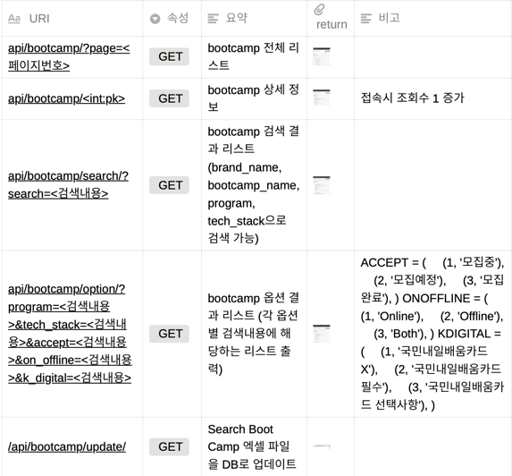

# 📄 [API 문서 ](https://www.notion.so/115c8836a57544c28a0a50d62442548d)




#  [Swagger API 문서](http://ec2-13-209-65-110.ap-northeast-2.compute.amazonaws.com:8000/swagger/)

## 📄 [swagger 사용법](https://wonderful-loan-f23.notion.site/SWAGGER-82505cf6c13845368f557932dc523d12)


---
# 1. 가상환경 설정

- 저는 아나콘다로 했는데 아래처럼 일케 하셔도 대여 (코드는 알아서 찾아보시는게 빠를지도 ㅎㅎ)

### 1) 가상환경 생성 및 실행

```
% python -m venv 가상환경이름 --python=python3.8
% cd 가상환경이름/Scripts
% activate.bat 
% cd 본 프로젝트 경로 

```

### 2) 최상위 폴더의 requirements.txt로 필요한 package 설치

```
% pip install requirements.txt
```

# 2. MariaDB 설정

### 1) mariaDB 터미널에서 database 생성

```
MariaDB [(none)]> create database 데이터베이스이름;
MariaDB [(none)]> use 데이터베이스이름;
Database changed
MariaDB [sbc]> grant all privileges on 데이터베이스이름.* to 'root'@'%' identified by '최초실행시생성한비밀번호';
```

### 2) settings.py에서 자신의 mariaDB 정보로 수정해줍니다

```python
DATABASES = {
    'default': {
        'ENGINE': 'django.db.backends.mysql',
        'NAME': '데이터베이스이름',
        'USER': 'root',
        'PASSWORD': '최초실행시생성한비밀번호',
        'HOST': '127.0.0.1',
        'PORT': '3306'
    }
}
```

# 3.  엑셀 데이터 DB에 저장하기

- 제 거는 코드에 맞게 수정된 파일이라 여러분 sheet에서는 다를 수 있어용
- 그럼 연락주세용 ~~~ 아님 제 걸로 그냥 돌려주세요~~~

### 1) 터미널에서 실행 후에 table이 생성되는지 확인해주세요 ~

```
% python manage.py makemigrations BootCamp
% python manage.py migrate 
```

### 2) [BootCampUpdate.py](http://BootCampUpdate.py) 수정하기

```python
conn = pymysql.connect(host='127.0.0.1', user='root', password='최초실행시생성한비밀번호', db='sbc')
curs = conn.cursor(pymysql.cursors.DictCursor)
```


### 3) 엑셀 파일 DB에 저장하기
```
% cd BootCamp
% python BootCampUpdate.py 
```


# 4. Django 초기 설정

- createsuperuser 슈퍼두퍼권한을 가진 admin 계정을 생성해주세용
- 서버 구동 후에 admin 페이지 가서 계정 잘 만들어졌나 확인해보세욥

```
% cd sbc_api
% python manage.py createsuperuser 
% python manage.py runserver 
```

# ‼️ 유의사항 

1) requirement.txt 파일이 계속 에러가 나면 이 파일로 수정해서 install 해주세요!

[requirements.txt](https://s3-us-west-2.amazonaws.com/secure.notion-static.com/8302aa1f-f046-4fc9-bd15-52dbf3347140/requirements.txt)
